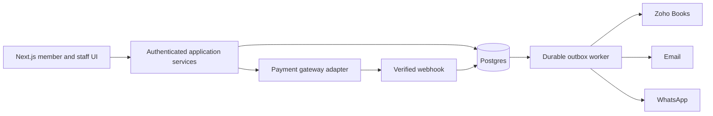

# Collabix: feature audit and implementation architecture

Reviewed 2026-09-16. Sources: `../demo-site/pricing.html` (the actual development proposal), `../demo-site/pricing-breakdown.html`, `../demo-site/assets/js/booking.js`, the seat-selector design spec, and the root brand README. This document distinguishes the implemented website preview from the proposed production platform.

## Delivered in this change

- `/` remains the original coming-soon page, with its original global styles and metadata.
- `/home`: native Next.js page preserving the demo content, imagery, navy/gold/ivory design, spaces, amenities teaser, location and responsive navigation.
- `/home/amenities`: demo amenities page.
- `/home/pricing`: customer-facing indicative workspace rates.
- `/home/booking`: React booking preview with space/date/time/duration, keyboard-accessible desk selection, conditional room flow, validated details and estimated totals. No personal data is persisted or sent.
- `/home/proposal`: original itemised development proposal for review. Quoted costs and third-party fees are historical proposal content, not current provider pricing. Direct-link only; no authentication, so this route is not confidential.
- Preview routes have `noindex` metadata. Assets are local. New styles are scoped to `.collabix-site` so they do not change `/`.

## All proposed capabilities

| Proposal requirement | Current state | Production implementation |
| --- | --- | --- |
| Branded home and amenities | Implemented | Verify final copy, photography, capacity and hours |
| Responsive desktop/mobile booking | Implemented preview | Connect to server availability and authenticated booking |
| Floorplan seat selection | Implemented preview | Resource IDs and server availability, same IDs across rate plans |
| Live availability, hold, confirm, double-booking prevention | Not implemented | Transactional resource reservations and expiring holds |
| Hourly/daily bookings | Preview | Server rate plans, opening hours, holidays, minimum/maximum duration |
| Recurring bookings | Not implemented | Booking series expanded into validated occurrences; atomic conflict policy |
| Admin dashboard and occupancy calendar | Not implemented | Authenticated staff views of reservations and operational exceptions |
| Visitor check-in/out and visitor log | Not implemented | Visitor + Visit records, host, timestamps, staff actions |
| Member records, profiles, ID/KYC and history | Not implemented | Member profile, private document storage, access audit and retention policy |
| Member login, verification and access control | Not implemented | Managed auth, verified identity and server-side membership checks |
| Membership plans, credits and wallet | Not implemented | Plan entitlements, subscriptions and append-only credit ledger |
| Pricing, discounts and coupons | Indicative hourly rates only | Server quotes, versioned price snapshots, coupon limits/redemption transactions |
| UPI/cards/net-banking payment gateway | Not implemented | Gateway adapter, checkout order, signed webhook and reconciliation |
| Payment verification | Not implemented | Match provider order, currency and amount; never trust browser success |
| Zoho Books GST invoices | Not implemented | Invoice adapter, tax profile and idempotent invoice creation after verified payment |
| Email and WhatsApp automation | Not implemented | Durable outbox, templates, consent and delivery status |
| Cancellation and no-show reminders | Not implemented | Policy snapshots, scheduled jobs, refunds and auditable status transitions |
| Revenue, occupancy and activity reporting | Not implemented | Paid/refunded ledger totals; occupancy measured against actual opening intervals |
| Staff roles and permissions | Not implemented | Member, receptionist, manager and owner capabilities enforced on the server |
| Secure backend, database, auth and deployment | Next.js frontend only | Managed Postgres, migrations, secret management, backup/restore and monitoring |
| SEO metadata, sitemap and search readiness | Preview metadata only | Production domain confirmation, canonical URLs and sitemap at launch |
| Hosting/SSL/CDN, mailboxes | Existing app; configuration not audited | Confirm Vercel deployment, DNS and chosen email provider |

## Open-source shortlist

Primary repositories were inspected online. No third-party source was copied into this change. License labels below reflect repository documentation; any later code import should pin a commit and retain its license and notices.

| Project | Observed stack/license | Fit and decision |
| --- | --- | --- |
| [UpSpace](https://github.com/ivanreeve/upspace) | Next.js, TypeScript, Prisma, Supabase/PostgreSQL; MIT-labelled repository | Closest technical reference. Study booking lifecycle, price snapshots, auth boundaries and payment adapter separation. Its marketplace, partner payouts, AI and Philippine Xendit integration are beyond this single-site scope. |
| [WARP](https://github.com/sebo-b/warp) | Flask/Python, Peewee, PostgreSQL; MIT | Useful reservation reference: floorplans, seats, zones, assigned seats and access rules. Translate domain concepts to TypeScript; do not add a Python service just for this. |
| [Roomer](https://github.com/c0dewhacker/Roomer) | TypeScript workspace app with separate API and web packages; AGPL-3.0 | Useful floorplan, recurring bookings, waitlist and delegated role reference. Architectural comparison only for now. |
| [Nadine](https://github.com/nadineproject/nadine) | Django/Python; AGPL-3.0 | Coworking operations reference with member/staff separation and accounting/access integrations. Larger runtime migration than Collabix needs. |

[UpSpace's schema](https://github.com/ivanreeve/upspace/blob/main/prisma/schema.prisma) shows separate spaces, areas, bookings, price rules, notifications, audit events and payment records. Booking records include price snapshots and time-window indexes. These are useful patterns, but an index alone does not establish concurrency-safe resource exclusion. Its area/capacity model needs a concrete per-seat resource layer for Collabix.

Recommendation (our assessment): keep the existing Next.js app and use UpSpace as the main architecture reference, supplemented by WARP's seat/zone model. Build a small modular monolith rather than importing a marketplace wholesale. No reviewed project was established as a drop-in implementation of the entire Collabix proposal, particularly Zoho Books, Indian checkout, visitors, credits and WhatsApp together.

## Proposed Next.js structure

```text
app/home/                   public experience (implemented)
app/(member)/               account, bookings, membership, invoices
app/(staff)/admin/           occupancy, members, visitors, payments, reports
app/api/availability/       public, limited availability queries
app/api/bookings/           authenticated quote/hold/cancel commands
app/api/webhooks/payments/  signature-verified gateway events
lib/domain/                 resource, booking, membership, billing rules
lib/server/                 repositories, auth guards, service orchestration
lib/integrations/           payments, Zoho Books, email, WhatsApp adapters
prisma/                    relational schema and versioned migrations
jobs/                      hold expiry, reminders, integration retries
```

Use server components for reads and route handlers/server actions for commands. Every command validates inputs and identity server-side. Keep database credentials and integration clients out of client components. Managed Postgres is the source of truth; Prisma is a suitable typed data-access option, with SQL migrations for exclusion constraints. A separate durable job runner or scheduled outbox processor handles background tasks; do not rely on work continuing after a Vercel response.



## Data model and invariants

- Location → Floor → Zone → Resource. Resource is a physical seat, cabin or meeting room; include coordinates and capacity. A rate plan is distinct from the physical resource.
- User → MemberProfile; staff RoleAssignment scoped to location. Document references point to private storage, never public uploads.
- Booking → BookingOccurrence → ResourceReservation. Store timestamps in UTC and render in `Asia/Kolkata`. Half-open `[start,end)` intervals allow adjacent bookings.
- Quote stores currency (INR), integer minor-unit amounts, line items, tax configuration, coupon and rate-policy snapshot. Calculate all final values on the server.
- Reservation states: `held → confirmed → checked_in → completed`; `held → expired`; cancellation/no-show transitions have explicit policy checks. Payment state is separate from occupancy state.
- Use a database exclusion constraint on resource ID + time range for held/confirmed reservations, or equivalent transaction locking with demonstrated concurrency tests. Expiry transitions must release the constraint transactionally; do not use a volatile `now()` predicate in an index.
- Create holds with a server expiry and idempotency key. On checkout completion, lock and recheck the hold. If payment arrives after expiry and the seat was reallocated, reconcile/refund instead of confirming an overlap.
- PaymentOrder, PaymentEvent (unique provider event ID), Payment, Refund and InvoiceReference are separate records. Signed webhook retries must not repeat invoices or credits.
- MembershipPlan → Membership → CreditLedger. Debit/credit entries are immutable; transactional balances and unique booking debit references prevent double spend.
- Visitor → Visit; track host, check-in/out, operator and audit trail.
- OutboxEvent stores integration payload reference, status, attempt count and next retry. Invoice/email failure must not erase a paid booking. Staff can see and retry exceptions.
- AuditEvent records actor, command, entity and result without payment secrets or raw ID documents.

## Decisions uncovered in the demo

1. The older seat spec calls for 24 hot seats + 12 dedicated seats. The latest JavaScript instead has one shared 12-seat bank (`D-01…D-12`), while the homepage advertises 120 seats. The preview follows the latest bank; actual inventory and dedicated assignment rules need confirmation before a database seed.
2. Demo rates are ₹120/₹200/₹600/₹900 per hour with an illustrative 18% tax calculation. These are not a verified price or tax configuration. Monthly packages, deposits, refunds and cancellation terms must be entered as business policy.
3. Demo 24/7 member access differs from the 08:00–20:00 booking window. Model access hours separately from public bookable hours.
4. The root README has the actual address and `connect@collabix.co.in`; the demo's `.example` email and dummy phone were removed in the port.
5. Existing root metadata uses `collabix.com`, while the brand README says `collabix.co.in`. Root was left unchanged as requested. Confirm the production domain before launch SEO work.

## Implementation sequence and acceptance gates

1. **Inventory + identity:** configure managed Postgres/auth; migrate resources, users and roles. Verify members cannot read other members' data or reach staff actions.
2. **Booking engine:** server quotes, availability, holds, expiry and booking history. Race two requests for one seat; exactly one succeeds. Check adjacency, timezone boundaries, multi-hour overlap, stale availability and repeated requests.
3. **Checkout + accounting:** sandbox gateway, verified events, refunds, Zoho adapter and outbox. Test duplicate/out-of-order webhooks, wrong amounts, expired holds, invoice retries and provider timeouts.
4. **Operations:** occupancy calendar, member/KYC workflows, visitor log, cancellation/no-show jobs and audit history.
5. **Memberships + reporting:** recurring reservations, credits, coupons, revenue/occupancy reports and reconciliation. Test series conflicts and concurrent wallet spending.
6. **Launch:** verify business inventory/rates/hours, approved content, domain, storage retention, backup restore and live integrations. Add sitemap and remove preview `noindex` only when ready.

The website preview can be reviewed immediately. The production platform above is not implemented by this UI migration; it needs the database, authentication and provider configuration described here.

## Validation for this change

- ESLint and TypeScript checks passed.
- All five `/home` pages passed React server-render smoke checks; no legacy relative HTML/asset links remained in rendered page content.
- Parsed the stylesheet and verified every non-keyframe selector is scoped to `.collabix-site`.
- The existing `app/page.tsx`, `app/layout.tsx` and `app/globals.css` have no diff.
- Normal `npm run build` was blocked by Google Fonts fetch failures in the unchanged root layout. A webpack production build with temporary `NEXT_FONT_GOOGLE_MOCKED_RESPONSES` passed compilation, type checking, prerendering and route generation. Mocks were outside the repository and are not production font assets; rebuild normally in a network-enabled environment before deployment.
- Browser interaction and visual checks could not run: this environment denied local listening ports (`EPERM`) and Chrome startup. Desk/room flows and mobile navigation still require browser acceptance testing. No deployment was performed.
